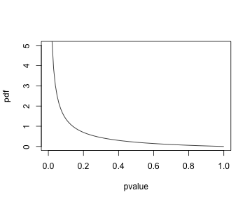
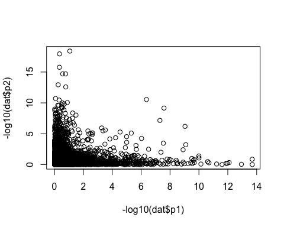
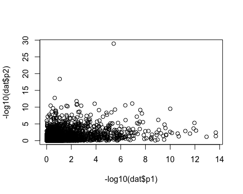

```r
library(pisquared)
require(rstan)
require(doMC)
registerDoMC(2)
```

First we'll simulate some p-values with specified non-null rates and sharing level. We'll use `Beta(a=0.2,b=2)` for the non-null pvalues: 

```r
true_alpha = 0.2
true_beta = 2
plot(function(p) dbeta(p, true_alpha, true_beta), ylim = c(0,5), xlab = "pvalue", ylab = "pdf")
```



We use pisquared's built-in function to simulate p-values with specified non-null rates and sharing. Here we set a low level of sharing. Note that some combinations of `pi_1`, `pi_2` and `true_jaccard` are not feasible, in which case you'll get a warning and `NULL` will be returned. 

```r
set.seed(12345)
dat = simulate_joint_pvalues(N = 10000, # typical num hypothesis tests in genomics
                            pi_1 = 0.1, # marginal pi1 (proportion non-null) for set 1
                            pi_2 = 0.1, # marginal pi1 (proportion non-null) for set 2
                            true_jaccard = 0.1, # true sharing level
                            alpha = true_alpha, # parameters of the beta distribution on 
                            beta = true_beta)
plot(-log10(dat$p1), -log10(dat$p2))
```



Let's see if pisquared can recover the sharing level and marginal pi1: 

```r
pi2_results = pi2_estimator(dat$p1, dat$p2)
pi2_results$jaccard
```

```
## [1] 0.0907733
```
This is pretty close to the true level of 0.1. 

What about for higher sharing level of 0.9? 

```r
set.seed(12345)
dat = simulate_joint_pvalues(N = 10000, # typical num hypothesis tests in genomics
                            pi_1 = 0.1, # marginal pi1 (proportion non-null) for set 1
                            pi_2 = 0.1, # marginal pi1 (proportion non-null) for set 2
                            true_jaccard = 0.9, # true sharing level
                            alpha = true_alpha, # parameters of the beta distribution on 
                            beta = true_beta)
plot(-log10(dat$p1), -log10(dat$p2))
```



It's pretty tough to see by eye whether there is much overlap between the tests. 

```r
pi2_results = pi2_estimator(dat$p1, dat$p2)
pi2_results$jaccard
```

```
## [1] 0.8599751
```
This is pretty close to the true level of 0.9. 

For more intensive investigation of the actual of pisquared across a range of sharing levels see `vignette("pisquared-extended")`. 
