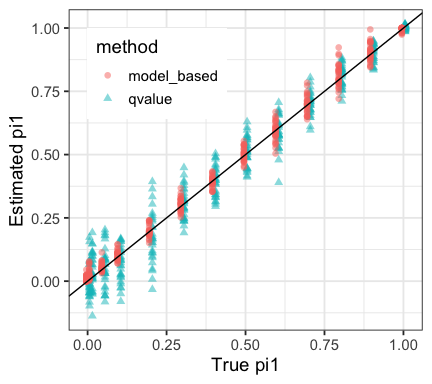
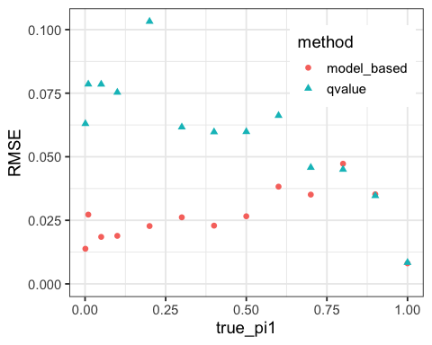
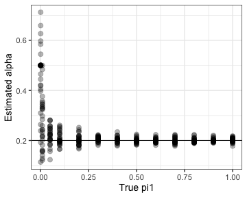
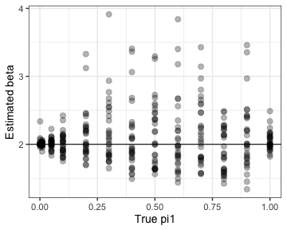
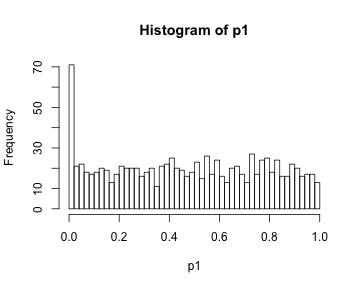
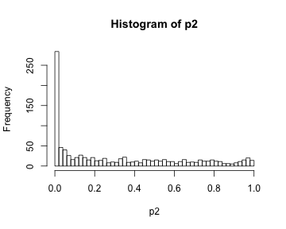
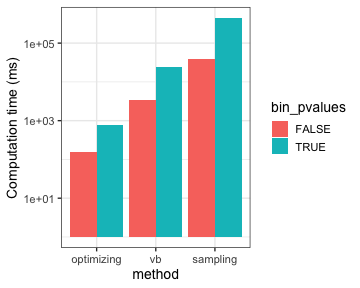
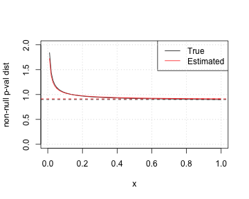
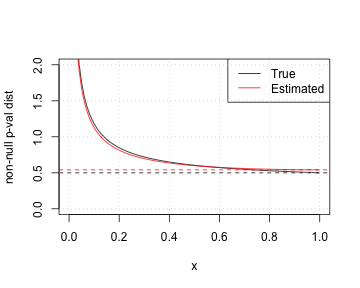
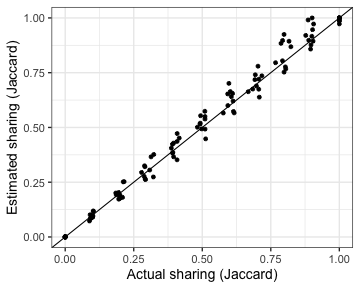

```r
library(pisquared)
require(tidyverse)
require(magrittr)
require(rstan)
require(doMC)
registerDoMC(detectCores() - 1) 
theme_set(theme_bw(base_size = 14))
```

## Model-based estimation of marginal pi0

Let's check how good a job we can do of estimating marginal pi0 across a range of parameters. We'll simulate some p-values with specified non-null rates. We'll use Beta(a=0.2,b=2) for the non-null pvalues: 

```r
true_alpha = 0.2
true_beta = 2
N = 1000
marg_results = foreach(true_pi1 = c(0.001,0.01,0.05,seq(.1,1,by=0.1)), .combine = bind_rows) %:%
  foreach(rep = 1:30, .combine = bind_rows) %dopar% {
    p = simulate_pvalues(N = N, pi1 = true_pi1, alpha = true_alpha, beta = true_beta)
    res = tryCatch(
      model_based_pi0(p, method = "optimizing") %>% 
        as_tibble() %>% 
        mutate(true_pi1 = true_pi1, 
               pi1 = 1 - pi0, 
               rep = rep, 
               qvalue_pi1 = 1 - pi0est_copy(p)$pi0),
      error = function(e) NULL
    )
}
marg_results
```

```
## # A tibble: 390 x 11
##      pi0 alpha beta_minus_one  beta alpha_sd beta_sd pi0_sd true_pi1      pi1   rep qvalue_pi1
##    <dbl> <dbl>          <dbl> <dbl>    <dbl>   <dbl>  <dbl>    <dbl>    <dbl> <int>      <dbl>
##  1 0.963 0.659          0.975  1.98    0.207    1.70 0.0888    0.001 3.67e- 2     1    0.0505 
##  2 1.00  0.500          1.00   2.00    0.264    2.19 0.500     0.001 1.03e-10     2   -0.00131
##  3 0.980 0.627          0.958  1.96    0.215    2.25 0.127     0.001 2.04e- 2     3    0.0647 
##  4 1.00  0.500          1.00   2.00    0.265    2.38 0.500     0.001 1.85e-10     4   -0.00252
##  5 0.990 0.421          1.00   2.00    0.205    1.84 0.0459    0.001 9.63e- 3     5   -0.0815 
##  6 1.00  0.500          1.00   2.00    0.260    2.18 0.500     0.001 2.62e-10     6   -0.0804 
##  7 1.00  0.500          1.00   2.00    0.267    2.16 0.500     0.001 1.77e-10     7   -0.0471 
##  8 1.00  0.500          1.00   2.00    0.263    2.47 0.500     0.001 9.83e-11     8   -0.00610
##  9 0.987 0.264          1.00   2.00    0.107    2.15 0.0152    0.001 1.28e- 2     9    0.00511
## 10 0.978 0.712          1.04   2.04    0.241    1.80 0.197     0.001 2.20e- 2    10    0.0374 
## # … with 380 more rows
```

Both Storey's qvalue and our model based approach give approximately unbiased estimates of pi0 in this setting: 

```r
res_gathered = marg_results %>% select(true_pi1, model_based = pi1, qvalue = qvalue_pi1) %>% 
  gather(method, est_pi1, -true_pi1) 
res_gathered  %>% ggplot(aes(true_pi1, est_pi1, col = method, shape = method)) + 
  geom_point(alpha = 0.5, size = 2, position = position_dodge(width = 0.02)) + 
  geom_abline(intercept = 0, slope = 1) + xlab("True pi1") + ylab("Estimated pi1") + 
  theme(legend.position = c(0.25,.8))
```



Errors are substantially lower for pisquared than Storey's pi0, as expected since the data is generated from the pisquared model. Additionally Storey's pi0 can be negative which is clearly unreasonable. 

```r
err_summary = res_gathered %>% 
  group_by(method, true_pi1) %>% 
  summarize(RMSE = sqrt(mean((true_pi1 - est_pi1)^2))) %>% 
  ungroup()
err_summary %>% ggplot(aes(true_pi1, RMSE, col = method, shape = method)) + geom_point(size = 2) + 
  expand_limits(y = 0) + theme(legend.position = c(0.8,.8))
```



alpha and beta are estimated quite robustly: 

```r
marg_results %>% 
  ggplot(aes(true_pi1, alpha)) + geom_point(alpha = 0.3, size = 3) + geom_hline(yintercept = true_alpha) + 
  xlab("True pi1") + ylab("Estimated alpha")
```



```r
marg_results %>% 
  ggplot(aes(true_pi1, beta)) + geom_point(alpha = 0.3, size = 3) + geom_hline(yintercept = true_beta) + 
  xlab("True pi1") + ylab("Estimated beta")
```



## Estimating sharing

We first consider independent p-values but with different non-null rates: 

```r
true_pi1s = c(0.1, 0.5)
p1 = simulate_pvalues(N = N, pi1 = true_pi1s[1], alpha = true_alpha, beta = true_beta)
p2 = simulate_pvalues(N = N, pi1 = true_pi1s[2], alpha = true_alpha, beta = true_beta)
hist(p1, 50)
```



```r
hist(p2, 50)
```



In our simulation p1 and p2 are independent so the "true" Jaccard index is small:

```r
true_jaccard = true_pi1s[1] * true_pi1s[2] / (1 - (1 - true_pi1s[1]) * (1 - true_pi1s[2]))
true_jaccard
```

```
## [1] 0.09090909
```

pisquared can use three methods provided by stan: maximum likelihood estimation ("optimizing"), variational Bayes ("vb") and Markov chain Monte Carlo ("sampling"). The fastest fitting approach is to do maximum likelihood estimation via LBFGS. 

```r
methods = c("optimizing", "vb", "sampling")
results = foreach(method = methods, .combine = bind_rows) %do% {
  foreach(bin_pvalues = c(T,F), .combine = bind_rows) %dopar% { 
    cpu_time = system.time( 
      pi2_result <- pi2_estimator(p1,
                               p2,
                               method = method, 
                               bin_pvalues = bin_pvalues)
    )
    marginal_pi0 = c(rowSums(pi2_result$pi)[1], colSums(pi2_result$pi)[1])
    tibble( method = method, 
            bin_pvalues = bin_pvalues,
            jaccard = pi2_result$jaccard, 
            jaccard_sd = pi2_result$jaccard_sd, 
            pi0_1 = marginal_pi0[1],
            pi0_2 = marginal_pi0[2], 
            cpu_time = cpu_time[1])
  }
}
results
```

```
## # A tibble: 6 x 7
##   method     bin_pvalues jaccard jaccard_sd pi0_1 pi0_2 cpu_time
##   <chr>      <lgl>         <dbl>      <dbl> <dbl> <dbl>    <dbl>
## 1 optimizing TRUE         0.0842     0.0464 0.811 0.638    0.765
## 2 optimizing FALSE        0.0454     0.0185 0.913 0.549    0.154
## 3 vb         TRUE         0.0558     0.0234 0.906 0.645   24.6  
## 4 vb         FALSE        0.0407     0.0135 0.924 0.563    3.42 
## 5 sampling   TRUE         0.0691     0.0371 0.858 0.638  446.   
## 6 sampling   FALSE        0.0486     0.0180 0.913 0.546   39.1
```

The red line here shows the true Jaccard sharing index. binning pvalues does come at a cost in accuracy. 

```r
results %>% ggplot(aes(method, jaccard, 
                       ymin = jaccard - jaccard_sd, 
                       ymax = jaccard + jaccard_sd, 
                       fill = bin_pvalues)) + 
  geom_col(position = "dodge") + 
  geom_errorbar(position = "dodge") +
  geom_hline(yintercept = true_jaccard, 
             col = "red")
```


The computation time for these methods is very different:

```r
results %>% mutate(method = factor(method, methods)) %>% 
  ggplot(aes(method, 1000 * cpu_time, fill = bin_pvalues)) + 
  geom_col(position = "dodge") + scale_y_log10() + ylab("Computation time (ms)")
```



Optimization performs as well as VB or sampling and is an order of magnitude (or two) faster so we'll use it for the rest of the vignette:

```r
pi2_result = pi2_estimator(p1,
                           p2,
                           method = "optimizing")
marginal_pi1 = c(rowSums(pi2_result$pi)[2], colSums(pi2_result$pi)[2])
marginal_pi1
```

```
## [1] 0.08657623 0.45102022
```

Plot fitted marginal p-value distributions (estimated vs true)

```r
dpi0 = function(p, pi1, alpha, beta) {
  (1-pi1)  + pi1 * dbeta(p, alpha, beta)
}
for (i in 1:2) { 
  plot(function(g) dpi0(g, true_pi1s[i], true_alpha, true_beta), 
       ylab = "non-null p-val dist", 
       ylim = c(0,2),
       col = 1)
  abline(h = 1-true_pi1s[i], col = 1, lty = 2)
  plot(function(g) dpi0(g, marginal_pi1[i], pi2_result$fit$par$alpha[i], pi2_result$fit$par$beta[i]), 
       col = 2,
       add = T)
  abline(h = 1-marginal_pi1[i], col = 2, lty = 2)
  legend("topright", legend=c("True", "Estimated"), col=1:2, lty = 1)
  grid()
}
```



## Estimating sharing across a range of underlying sharing levels

Here we simulation two arrays of p-values with specific sharing ("true_jaccard") and 

```r
N = 10000
jacc_results = foreach(true_jaccard = seq(0,1,by=.1), .combine = bind_rows) %:% 
  foreach(rep = 1:10, .combine = bind_rows) %dopar% {  # .combine = bind_rows, 
    set.seed(rep)
    dat = simulate_joint_pvalues(N = N, 
                                pi_1 = 0.1, 
                                pi_2 = 0.1,
                                true_jaccard = true_jaccard, 
                                alpha = true_alpha, 
                                beta = true_beta)
    if (is.null(dat)) return(NULL)
    counts = dat %>% select(hit1, hit2) %>% table()
    pi2_result <- pi2_estimator(dat$p1, dat$p2) # , method = "vb")
    tibble(true_jaccard = true_jaccard, 
           actual_jacc = counts["TRUE", "TRUE"] / (counts["FALSE", "TRUE"] +  counts["TRUE", "FALSE"] + counts["TRUE", "TRUE"]), 
           est_pi1_1 = rowSums(pi2_result$pi)[1], 
           est_pi1_2 = colSums(pi2_result$pi)[1],
           est_jaccard = pi2_result$jaccard, 
           jaccard_sd = pi2_result$jaccard_sd)
}
jacc_results
```

```
## # A tibble: 110 x 6
##    true_jaccard actual_jacc est_pi1_1 est_pi1_2 est_jaccard jaccard_sd
##           <dbl>       <dbl>     <dbl>     <dbl>       <dbl>      <dbl>
##  1            0           0     0.901     0.899    2.57e- 7     0.253 
##  2            0           0     0.895     0.897    2.71e- 3     0.0581
##  3            0           0     0.898     0.901    4.83e- 8     0.247 
##  4            0           0     0.896     0.904    1.13e- 7     0.240 
##  5            0           0     0.905     0.893    2.45e- 6     0.253 
##  6            0           0     0.905     0.901    1.13e- 5     0.235 
##  7            0           0     0.899     0.891    3.61e- 9     0.262 
##  8            0           0     0.909     0.905    1.50e- 7     0.256 
##  9            0           0     0.897     0.905    6.21e- 6     0.225 
## 10            0           0     0.899     0.902    8.69e-10     0.248 
## # … with 100 more rows
```

Plot the results: we see pisquared provides unbiased and accurate sharing estimates. 

```r
jacc_results %>% ggplot(aes(actual_jacc, est_jaccard)) + geom_point() + 
  xlab("Actual sharing (Jaccard)") + ylab("Estimated sharing (Jaccard)") + 
  geom_abline(intercept = 0, slope = 1)
```



